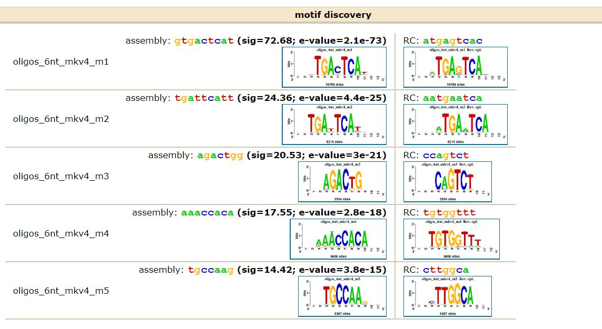

```{r setup, include=FALSE}
knitr::opts_chunk$set(echo = FALSE, warning=FALSE, message=FALSE, error=FALSE)

library(ChIPseeker)
library(TxDb.Hsapiens.UCSC.hg19.knownGene)
txdb = TxDb.Hsapiens.UCSC.hg19.knownGene
library(clusterProfiler)
library(org.Hs.eg.db)
library(knitr)
```

### Overview

The following data is from a transcription factor ChIP-Seq experiment that looked at DNA binding to androgen receptors (AR). ChIP-seq was performed on two biological replicates from a human bladder cancer cell line. A control ChIP(with IgG)-Seq was performed as well.

### Peak Calling

Peaks were called for the two ChIP samples to determine which areas of the genome were interacting/binding with the receptors. MACS2 was used with the following code.

```macs2 callpeak -t "/BIOS6660/Homework8/data/chip1.markdup.bam" -c "/BIOS6660/Homework8/data/input.markdup.bam" -g hs -n chip1_peaks -f bam --keep-dup auto --bdg```
```macs2 callpeak -t "/BIOS6660/Homework8/data/chip2.markdup.bam" -c "/BIOS6660/Homework8/data/input.markdup.bam" -g hs -n chip2_peaks -f bam --keep-dup auto --bdg```

The results are located on Yampa under: /BIOS6660/Homework8/data/

### Peak Annotation

The promoter regions were determined and the distance between the peaks and the promoter regions are shown in the graph below.

```{r promoter, results='hide'}

# Read in bed files
chip1_peak = read.table("~/BIOS6660/Homework_8/Data/homework8_chip1_peaks_peaks.narrowPeak")
chip2_peak = read.table("~/BIOS6660/Homework_8/Data/homework8_chip2_peaks_peaks.narrowPeak")

# Put them together
all_peaks = rbind(chip1_peak,chip2_peak)
write.table(all_peaks[,c(1:3,5,10)], file = "~/BIOS6660/Homework_8/data/all_peaks.bed", row.names = F, col.names = F, quote = F, sep = "\t")
all_peaks = read.table("~/BIOS6660/Homework_8/Data/all_peaks.bed")

# Find what you consider promoter regions
promoter = getPromoters(TxDb=txdb, upstream=3000, downstream=3000)
# find distance peaks are to promoter regions
tagMatrix = getTagMatrix("~/BIOS6660/Homework_8/Data/all_peaks.bed", windows=promoter)

plotAvgProf(tagMatrix, xlim=c(-3000, 3000), xlab="Genomic Region (5' -> 3')", ylab="Read Count Frequency")
```


The peaks were then annotated and the results can be seen below.

```{r annotate, results='hide'}

# Get peak annotation
peakAnno = annotatePeak("~/BIOS6660/Homework_8/Data/all_peaks.bed",
                        tssRegion=c(-3000,3000), TxDb=txdb, annoDb="org.Hs.eg.db")
peaks_wAnno = as.data.frame(peakAnno)

plotAnnoPie(peakAnno)
```

### Motif Analysis

RSAT was used to identify which motifs were enriched based on these peaks. The results can be found [here](http://rsat.sb-roscoff.fr/tmp/apache/2019/04/05/peak-motifs.2019-04-05.161943_2019-04-05.161943_uxnSkQ/peak-motifs_synthesis.html#merged_sites). The top five motifs are shown below. 

```{r motif}

```

### Peak Integration

```{r integrate}

# Read in differential expression candidates
DEcand = read.table(file="~/BIOS6660/Homework_8/Data/Array.diffExpr.geneSymbol.ensembl.txt", sep="\t", header=TRUE )

# Find peaks within 3,000 bp of TSS
peaks3000 = peaks_wAnno[which(abs(peaks_wAnno$distanceToTSS)<=3000),]

# Get gene symbols from peak data
peaks_genes = data.frame(unique(peaks3000$SYMBOL), "chip")
colnames(peaks_genes) = c("gene", "chip")

# Get gene symbols from DE data
DE_genes = data.frame(unique(DEcand$Associated.Gene.Name), "DE")
colnames(DE_genes)= c("gene", "chip")

# Merge peak and DE genes, get overalapping genes
both_genes = merge(peaks_genes, DE_genes, by="gene", all=FALSE)
gene_names = as.character(both_genes$gene)
```

The resulting peaks were integrated with gene expression candidates by determining which candidates had a peak within 3,000 bp of the transcription start site (TSS). There were `r prettyNum(nrow(DE_genes))` differentially expressed candidates and `r prettyNum(nrow(both_genes))` had a peak within 3,000 bp of the TSS.

### Enrichment Analysis

Enrichment analysis was then performed on these `r prettyNum(nrow(both_genes))` genes using enrichR to determine if they are part of any known biological pathway or system. Using the GO Biological Process 2018 database, the top 10 processes with the smallest p-values are listed below.

```{r enrichment, results='hide', cache=TRUE}
library(enrichR)

# perform enrichment analysis
dbs = c("GO_Molecular_Function_2018", "GO_Biological_Process_2018", "KEGG_2016")
enrich = enrichr(gene_names, dbs)

# get top 10 enriched processes
top10_enrich = head(enrich$GO_Biological_Process_2018[ ,1:3], n=10)
top10_enrich = top10_enrich[order(top10_enrich$P.value), ]
colnames(top10_enrich) = c("Process", "Overlap", "P-value")
```

`r kable(top10_enrich, align=c('l','c','c'), row.names=FALSE, digits=6)`